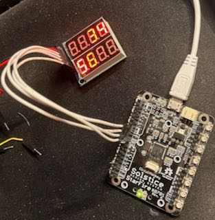
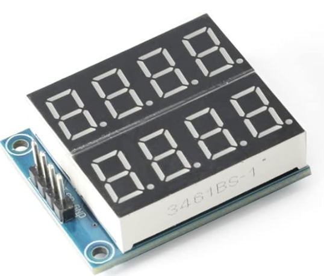
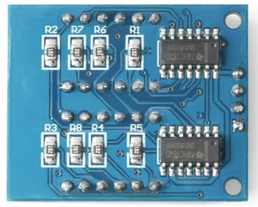

# hc164-2x4-led-segment-module
Resources for a 74HC164 based 2x4 LED segment module.

This repo has some short demo code for a HC164 based seven segment
display module available on Amazon and other asian source sites.

Amazon Link: https://www.amazon.com/dp/B0BG2G95CT

